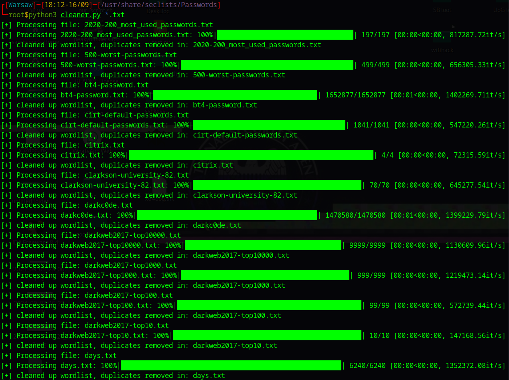

# Dictionary cleaner

## Installation
```
  git clone https://github.com/Bugyei-Thomas/dictionary-cleaner/
  cd dictionary-cleaner
  pip3 install tqdm
```

## Usage
```
  python3 cleaner.py <file1> <file2> <file3>...
```

## Example
</img>
